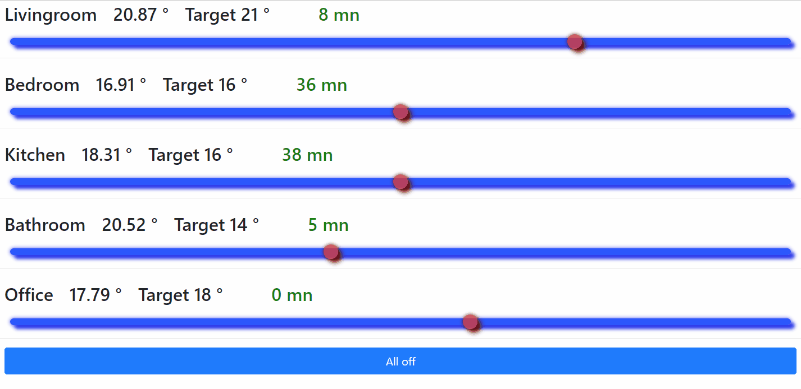

# raspi
raspberry pi home server scripts and configuration files of different frameworks

- py/esp32 : ruler script taking as input any mqtt event and as output triggering an esp32 mqtt actions
- py/hue : any mqtt event result in controlling Hue light
- py/influx : database client from mqtt to influx, whitelisted elements, with some forcing of data types
- py/nrf_mesh : nRF52832 low power sensors (temp,hum,press,light) and repeater dongles to mqtt
- zigbee/graphview : zigbee2mqtt graphviz web viewer

# nrf mesh

## nRF52 Mesh Dongle required
* see details in hackaday project [nRF5 Custom Mesh Network](https://hackaday.io/project/124114-nrf5-custom-mesh-network/details)

* [nRF 52 Dongle Firmware - github](https://github.com/nRFMesh/nRF52_Mesh)
  
  * [uart dongle firmware - gihub directory](https://github.com/nRFMesh/nRF52_Mesh/tree/master/applications/04_uart_dongle)
  * [usb dongle firmware - gihub directory](https://github.com/nRFMesh/nRF52_Mesh/tree/master/applications/08_usb_dongle)

## running the scripts

[py/nrf_mesh](./py/nrf_mesh/)

    cu -l /dev/ttyACM0 -s 460800 


subscribe to topic

    mosquitto_sub -t 'nrf/#' -v | ts

start nrf_mesh

    python3 py/nrf_mesh/nrf_mesh.py


## use as a service

see [install_services.sh](install_services.sh)

# zigbee/graphview

[zigbee/graph_view](./zigbee/graph_view/)


## Features
* configurable ip, port and mqtt base name
* multiple hosts for those using mulitple zigbee2mqtt instances.
* svg pan zoom for simpleefficient viewing. graphs can be so huge that text gets tiny.
* red buttons for change graph layout algorithm. Depending on the network, some algos can be more convenient than others

Note that the following viewer is hosted on github and has therefore a secure connection that shall not swap to a local home connection.

## Inactive hosted page

[link to inactive viewer](https://homesmartmesh.github.io/raspi/zigbee/graph_view/index.html)

In order to use this script, it is required to host it locally on local raspberry py, see [deploy](zigbee/graph_view/deploy.sh) script for deployment convenience. Direct usage from the link would require to authorise cross origin on chrome symbol on right of the adress bar.

# heating

## web heat control



The control of the heating has a feedback that ensures the execution of the command. The green displayed numbers represent the time since the last status of the zigbee device. Once a slider is modified and a command is sent, a feedback shall be received within few seconds and the time since last message should drop to `0 mn`

## python heat windows monitor

1. adjust your mqtt configuration in [config.json](raspi/heat/config.json)
2. adjust the eurotronic heater topic and apertures (apertures are the contact sensors list)
```json
    "heatings":{
        "living heat":{
            "topic":"lzig/living heat/set",
            "Apertures":[
                "balcony door",
                "balcony window right",
                "balcony window left"
            ]
        }
    }
``` 
3. add the contact sensors to the mqtt subscriptions as well
4. run the script `python raspi/heat.py`

example eurotronic mqtt payload
```json
zig/living heat {
    "current_heating_setpoint":17,
    "eurotronic_system_mode":1,
    "local_temperature":18.49,
    "occupied_heating_setpoint":21,
    "unoccupied_heating_setpoint":16,
    "eurotronic_error_status":0,
    "pi_heating_demand":0,
    "battery":100,
    "linkquality":44
}
```

## docu references

- [slider editing web page](http://danielstern.ca/range.css/#/)
- [slider css docu](https://css-tricks.com/styling-cross-browser-compatible-range-inputs-css/)
- https://www.w3schools.com/jsref/dom_obj_event.asp
- https://www.w3schools.com/jsref/dom_obj_all.asp
- https://patrickhlauke.github.io/touch/
- on release working : https://codepen.io/mhartington/pen/HKGno
