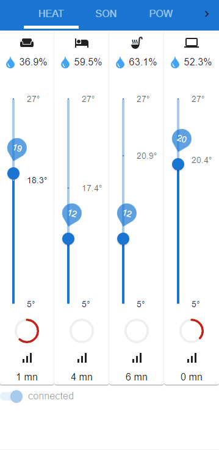
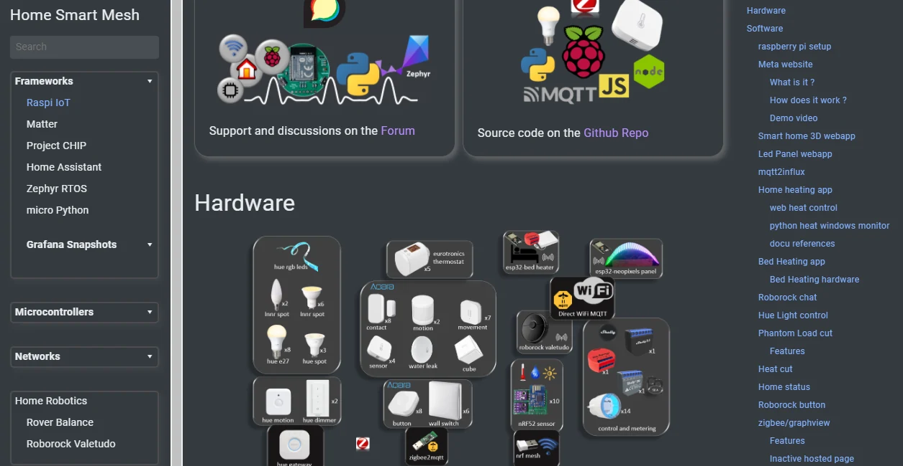

raspberry pi server for home automation. For developers, startups, students and hobbyist who want to understand the basics of home automation and IoT and use it for their own projects and products. Networks devices using Thread, Zigbee, wifi are are centralized with mqtt then controlled with services based on python and node.js scripts interacting with web apps as user Front End.

# Webapp
This webapp from the [web/home-next](./web/home-next/) directory is based on [next.js](https://nextjs.org/), [Material UI](https://mui.com/) and [MQTT.js](https://github.com/mqttjs/MQTT.js#readme).
* The Heat panel controls the temperature with `Eurotronics` Zigbee valves running on [Zigbee2mqtt](https://zigbee2mqtt.io/). The room humidity is also shown from [nRF custom sensors](https://github.com/nRFMesh/nRF52_Mesh)
* The sound panel controls sonos system to switch it on and off through `Tuya` smart sockets, and it controls the volume through [node-sonos-http-api](https://github.com/jishi/node-sonos-http-api). The sockets can also be controlled with an `Aqara` button.
* The power panel controls `Tuya` smart sockets and displays the power consumption. On and Off images are updated depending on the state. The PC socket is switched on with an `Aqara` button and switched off with an auto power off [pc_control](./js/pc_control/) script.
* The Ambient Panel is a Grafana dashboard that shows the last day charts of humidity, temperature and light from the [nRF custom sensors](https://github.com/nRFMesh/nRF52_Mesh)
* The Energy panels is also a Grafana dashboard that shows cumulated energy for the last 24h or last 30d, combining energy measures from `Shelly plug s` wifi and `Tuya` zigbee sockets.




# Website
Details about the development and frameworks in the website

[](https://www.homesmartmesh.com/docs/frameworks/raspi_iot/)

https://www.homesmartmesh.com/docs/frameworks/raspi_iot/

# Safety notice
* Power Sockets have deadly voltage and should not be self altered
* Usage of certified products such as Shelly or others is recommended for any high voltage product
* hacking custom scripts to control equipment might improve safety in case you add power cut off to a lower power for each section and device, but might also alter your food if your fridge inadvertantly goes off due to a wrong configuration
  * reboot state
  * safety power too low
* Any heat power control custom script must necessarily have another safe switch to fully cut the power when away or device is inattended.

# License
MIT

# Install

```shell
curl https://raw.githubusercontent.com/HomeSmartMesh/raspi/master/get_raspi.sh -o get_raspi.sh
sudo sh get_raspi.sh
```
