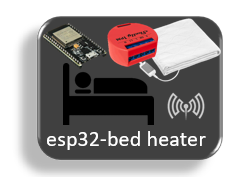
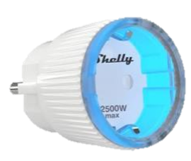

# raspi IoT
raspberry pi server for home automation. 'No limits' to what you can do with python and node.js services interfaced with javascript web apps.
This Fremwork is a lightweight mqtt interconnect between devices (HW), services (Automation) and webapps (UI).

# Support
* I'm using the scripts from this repo, they are running 24/7 and have a stunning reliability. Total system failure rate is nearing that of the HW devices. No reboots ever required.
* Each service has a log file to trace back unintended behavior and complex logic.
* I'll provide support for any question or suggestion on https://github.com/HomeSmartMesh/raspi/issues

# Safety warning
* Power Sockets have deadly voltage and should not be self altered
* Usage of certified products such as Shelly or others is recommended for any high voltage product
* hacking custom scripts to control equipment might improve safety in case you add power cut off to a lower power for each section and device, but might also alter your food if your fridge inadvertantly goes off due to a wrong configuration
  * reboot state
  * safety power too low
* Any heat power control custom script must necessarily have another safe switch to fully cut the power when away or device is inattended.

# Software


* Raspbian OS
* Main services
  * Mosquitto : https://mosquitto.org/
  * influxDB : https://www.influxdata.com/products/influxdb-overview/
  * mqtt2influx : [py/influx](./py/influx)
  * Grafana : https://grafana.com/
  * graphql sensors : [js/graphql](./js/graphql)
* x to mqtt
  * Zigbee2mqtt : https://www.zigbee2mqtt.io/
  * nrf2mqtt : [github nRF52_Mesh nrf_mesh](https://github.com/nRFMesh/nRF52_Mesh/tree/master/raspi/nrf_mesh)
  * miflora2mqtt : https://github.com/RaymondMouthaan/miflora-mqtt-daemon
  * telegram bots2mqtt : [js/telegraf](./js/telegraf) based on https://github.com/telegraf/telegraf
* automation services
  * Light control : [py/hue](./py/hue)
  * Phantom Load cut : [js/pc_control](./js/pc_control)
  * Heat cut : [py/heating](./py/heating)
  * Home status : [py/home_status](./py/home_status)
  * Roborock button : [py/hover](./py/hover)
* user interface
  * 3D webapp : https://github.com/HomeSmartMesh/smart_home_3d_webapp
  * Led panel : [js/leds_panel](./js/leds_panel)
  * Bed heating : [js/bed_heating](./js/bed_heating)
  * Roborock Chat : [js/telegraf/hover_poll.js](./js/telegraf/hover_poll.js)

# Hardware


* Zigbee
  * Hue Light with Hue gateway
  * Eurotronics thermostats with zigbee2mqtt
  * Aquara sensors with Zigbee2mqtt
* WiFi
  * ESP32 bed heater
  * ESP32 neopixels led panel
  * Shelly power control and monitor
  * Roborock with valetudeo server : https://github.com/Hypfer/Valetudo
* Custom RF
  * nRF52 sensors with [nRF52 Mesh](https://github.com/nRFMesh/nRF52_Mesh)
* ESP32
  * led panel : [github esp32_iot rgb_led](https://github.com/HomeSmartMesh/esp32_iot/tree/master/rgb_led)
  * bed heating [github esp32_iot bed_heater](https://github.com/HomeSmartMesh/esp32_iot/tree/master/bed_heater)

# Smart home 3D webapp


Attempt to unify interfaces in one app. Result is quite a success though requires a beast GPU and quite some effort to arrange 3D details and camera positioning to get a nice user experiance out of it.
* Has it's own github repo : https://github.com/HomeSmartMesh/smart_home_3d_webapp
* Hackaday project : https://hackaday.io/project/169046-smart-home-3d-webapp
* Even a Hackaday Blog entry : https://hackaday.com/2019/12/29/the-smart-home-gains-an-extra-dimension/

# Led Panel webapp


* Hackaday project : https://hackaday.io/project/162825-neopixels-animations-on-esp32-mqtt-json-webapp
* youtube video : https://www.youtube.com/watch?v=LMJBS6VYZzk


# Home heating app

## web heat control


The control of the heating has a feedback that ensures the execution of the command. The green displayed numbers represent the time since the last status of the zigbee device. Once a slider is modified and a command is sent, a feedback shall be received within few seconds and the time since last message should drop to `0 mn`

## python heat windows monitor

1. adjust your mqtt configuration in [config.json](raspi/heat/config.json)
2. adjust the eurotronic heater topic and apertures (apertures are the contact sensors list)
```json
    "heatings":{
        "living heat":{
            "topic":"lzig/living heat/set",
            "Apertures":[
                "balcony door",
                "balcony window right",
                "balcony window left"
            ]
        }
    }
``` 
3. add the contact sensors to the mqtt subscriptions as well
4. run the script `python raspi/heat.py`

example eurotronic mqtt payload
```json
zig/living heat {
    "current_heating_setpoint":17,
    "eurotronic_system_mode":1,
    "local_temperature":18.49,
    "occupied_heating_setpoint":21,
    "unoccupied_heating_setpoint":16,
    "eurotronic_error_status":0,
    "pi_heating_demand":0,
    "battery":100,
    "linkquality":44
}
```

## docu references

- [slider editing web page](http://danielstern.ca/range.css/#/)
- [slider css docu](https://css-tricks.com/styling-cross-browser-compatible-range-inputs-css/)
- https://www.w3schools.com/jsref/dom_obj_event.asp
- https://www.w3schools.com/jsref/dom_obj_all.asp
- https://patrickhlauke.github.io/touch/
- on release working : https://codepen.io/mhartington/pen/HKGno

# Bed Heating app


* web app : [js/bed_heater](./js/bed_heating/)

## Bed Heating hardware


* ESP32 firmware : [github esp32_iot bed_heater](https://github.com/HomeSmartMesh/esp32_iot/tree/master/bed_heater)
* using a Shelly 1 pm : https://shelly.cloud/shelly-1pm-wifi-smart-relay-home-automation/
* A standard off the shelf bed heating matrass
* A Solid state relay

# Roborock chat


* using the amazing node.js telegraf framework : https://github.com/telegraf/telegraf
* Roborock Chat : [js/telegraf/hover_poll.js](./js/telegraf/hover_poll.js)

# Hue Light control
* Controls all the Hue light bulbs from Aquara sensor switches using the [HUE rest API](https://developers.meethue.com/develop/get-started-2/)
* custom functions
  * Long press for minimal dimming
  * Toggle on of or Toggle dim states
* [py/hue](./py/hue)

# Phantom Load cut
* Some home devices especially device clusters such as TV sets and surroundings or PC and surroundings do have a significant cumulated power usage when in a standby mode.
* Who likes to pay money for non used electricity ?
* Who likes to keep remembering each time and toggling switching on locations hard to access ?
* This scrips [js/pc_control](./js/pc_control) comes to the rescue and does this for you in a smart way.

## Features
* configurable standby power level. For example a TV set with sound system consumes 100 W to 200 W but when on standby, still ~ 11 W
* a shelly socket provides a real time power usage through mqtt
* if the device is in standby < 12 W for more than 5 min, the shelly device is ordered to cut the power resulting in 1 W for the shelly device power usage (wifi connection). Therefore a permanent 10 W is saved.
* Low Motion sensors attached to the chair or to the remote control order the shelly to switch on again. False positive is not a problem and only costs 10W standby consumption for 5 more min before cutting again.
* If the TV started really to be used and power is > 12 W, then the standby power cut system is not doing anything so that the user enjoys watching TV until the next TV switch off cycle.

# Heat cut


* Hackaday page : [Aquara and Eurotronics hand in hand to save energy](https://hackaday.io/project/124114-nrf5-custom-mesh-network/log/168774-aqara-and-eurotronics-hand-in-hand-to-save-energy)

* Opening a window without remembering to switch the heating off can cost a peak of heat that consists of the major power cost of the whole day !
* The smart detection based on temperature drop is no reliable and only acts late sometimes when not necessary.
* With a simple aquara contact switch the system is now reliable
* Python service : [py/heating](./py/heating)

# Home status


* Leaving home, in a hurry, no time to walk through the house or to start smartphone apps to know if the heating is forgotten in one room or if a window is left open in another.
* With this script [py/home_status](./py/home_status), you see the home status right next to the house door before leaving
* Any window is open : The status light is blue
* Any heater is active : The status is red
* Both red and blue can be combined

How does this work. In a controlled environemnt where the wifi is reliable, there is no need for wifi status as it is always on. Therefore the led status disable function can be re-used for another purpose. This provide the nicest integration of led status including power supply, mqtt connection without even blocking the socket for other usage.

Below are the control URLs to turn led color on and off :
```json
    "status":{
        "red":{
            "on":"http://10.0.0.48/settings/?led_power_disable=false",
            "off":"http://10.0.0.48/settings/?led_power_disable=true"
        },
        "blue":{
            "on":"http://10.0.0.48/settings/?led_status_disable=false",
            "off":"http://10.0.0.48/settings/?led_status_disable=true"
        }
    }
```

# Roborock button
As Roborock [valetudo](https://github.com/Hypfer/Valetudo) provides an mqtt interface, all it takes is this script [py/hover](./py/hover) to order cleaning of a room or a section with a click on an aquara zigbee button.

# zigbee/graphview

[zigbee/graph_view](./zigbee/graph_view/)


## Features
* configurable ip, port and mqtt base name
* multiple hosts for those using mulitple zigbee2mqtt instances.
* svg pan zoom for simpleefficient viewing. graphs can be so huge that text gets tiny.
* red buttons for change graph layout algorithm. Depending on the network, some algos can be more convenient than others

Note that the following viewer is hosted on github and has therefore a secure connection that shall not swap to a local home connection.

## Inactive hosted page

[link to inactive viewer](https://homesmartmesh.github.io/raspi/zigbee/graph_view/index.html)

In order to use this script, it is required to host it locally on local raspberry py, see [deploy](zigbee/graph_view/deploy.sh) script for deployment convenience. Direct usage from the link would require to authorise cross origin on chrome symbol on right of the adress bar.

## Logging
### Log.io
* exposing log files to webapps :
* `js/log.io/server.json`
* https://github.com/NarrativeScience/log.io

## trnasport-browserconsole
* https://www.npmjs.com/package/winston-transport-browserconsole

# Docker compose commands

```bash
dc logs webapps

dc stop webapps
dc rm
dc up -d --build webapps

dc ps
dc images

docker rmi nginx
docker ps
docker attach 8f5000b5df47
docker exec -it d07161590a12 bash
```
