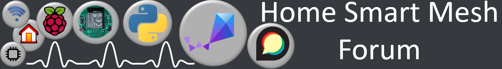

raspberry pi server for home automation. For developers, startups, students and hobbyist who want to understand the basics of home automation and IoT and use it for their own projects and products. Networks devices using Thread, Zigbee, wifi are are centralized with mqtt then controlled with servies based on python and node.js scripts interacting with web apps as user Front End.

# Documentation

https://www.homesmartmesh.com/docs/frameworks/raspi_iot/
# Forum

get support, give feedback or simply chat about ideas on the forum in the [Home Smart Mesh Forum - Frameworks Category](https://homesmartmesh.discourse.group/c/frameworks/11)

# Safety warning
* Power Sockets have deadly voltage and should not be self altered
* Usage of certified products such as Shelly or others is recommended for any high voltage product
* hacking custom scripts to control equipment might improve safety in case you add power cut off to a lower power for each section and device, but might also alter your food if your fridge inadvertantly goes off due to a wrong configuration
  * reboot state
  * safety power too low
* Any heat power control custom script must necessarily have another safe switch to fully cut the power when away or device is inattended.

# License
MIT