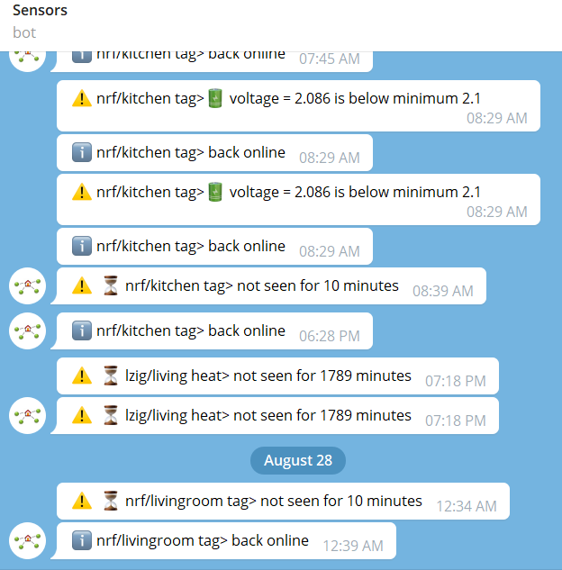

# Intro
Telegram [bot client](https://github.com/telegraf/telegraf) to watch all of your MQTT sensors for liveliness and low battery with a simple, non redundant, configuration.




# Install

    cd ./raspi/js/watch_bots
    npm install
    pm2 start watch_bots.js

Note : [pm2](https://pm2.keymetrics.io/docs/usage/quick-start/) is a one line to turn a node.js file into a service

# get bot token
* chat with botfather /newbot
* click on botfathers bot link to chet with it
* send many messages required to trigger the api response
* https://api.telegram.org/bot<YourBOTToken>/getUpdates

# Config
The idea is to configure as many sensors with as less declaration redunduncy as possible. You first declare lists of MQTT topics, then configure alert parameters for each list only once.

* `mqtt.lists` is a map grouping sensors into lists
* `watch` is a map where each list has a sensor name which matching a message field. These fields names are completely generic and only have to match the MQTT json payload content. The unit is also defined by the gateway translating to MQTT and is generally the same for the same type of devices, therefore the lists can be grouping the devices that have the same field name using the same unit. Note in the example `nrf` list uses `voltage` as float while `aqara` has the same filed but in millivots. That is why this config places fields under a list and not absolute for all monitoring.
* `minimum` will trigger a comparision check and an alert when below the given value
* `alive_minutes_sensor` checks each sensor topic independently to be more lively than the given time
* `alive_minutes_list` cheks all sensors together from the given list where any would keep it alive. This is more helpful to quicker findout if the gateway is down earlier than a single sensor alert latency.

## Config Example
`config.json`
```json
{  
    "mqtt":{
        "host":"10.0.0.42",
        "port":1883,
        "keepalive":60,
        "client_id":"watch_bots",
        "lists":{
            "eurotronics":[
                "lzig/living heat",
                "lzig/kitchen heat",
                "lzig/bedroom heat",
                "mzig/office heat",
                "lzig/bathroom heat"
            ],
            "nrf":[
                "nrf/livingroom window tag",
                "nrf/hallway tag",
                "nrf/balcony tag",
                "nrf/bathroom tag",
                "nrf/livingroom tag",
                "nrf/office tag",
                "nrf/bedroom tag",
                "nrf/kitchen tag"
            ],
            "aqara":[
                "mzig/bed weather",
                "lzig/bedroom window",
                "lzig/kitchen window",
                "lzig/office switch",
                "lzig/fridge weather",
                "mzig/balcony window left",
                "mzig/balcony window right",
                "mzig/balcony door",
                "lzig/office window left",
                "lzig/office window right"
            ]
        },
        "publish" :true,
        "subscribe" :true
    },
    "watch":{
        "nrf":{
            "voltage":{
                "minimum":2.1
            }
        },
        "aqara":{
            "voltage":{
                "minimum":1800
            }
        },
        "eurotronics":{
            "battery":{
                "minimum":15
            }
        }
    },
    "alive_minutes_sensor":{
        "nrf":10,
        "aqara":65,
        "eurotronics":120
    },
    "alive_minutes_list":{
        "nrf":1
    },
    "log":{
        "logfile":"/home/pi/share/watch_bots (date).log",
        "level":"info"
    }
}
```

Note about logfile `(data)`. That will be replaced by the date when the script is started. It is possible to give the path of a samba share so that it's easily accessible from the main desk PC.
# Bots secret example
a new file has to be created with the name `secret.json`. The reson it is not already in the repo is that it is ignored by git so it is safe to keep a secret in it without pushing it to a public repo. But the `secret_template.json` can be renamed and the example below can help.
```json
{
    "bots":{
        "smart_hover_bot":{
            "token": "1234567891:AAAAAAAAAAAAAAAAAAAAAAAAAAAAAAAAAAAAAAAA",
            "chatId":"123456789"
        },
        "Grafana_hsm_bot":{
            "token": "1234567891:AAAAAAAAAAAAAAAAAAAAAAAAAAAAAAAAAAAAAAAA",
            "chatId":"123456789"
        },
        "sensors_watch_bot":{
            "token": "1234567891:AAAAAAAAAAAAAAAAAAAAAAAAAAAAAAAAAAAAAAAA",
            "chatId":"123456789"
        }
    },
    "users":[
        321654987,
        321654988
    ]
}
```

## running

    pm2 start watch_bots.js --daemon

