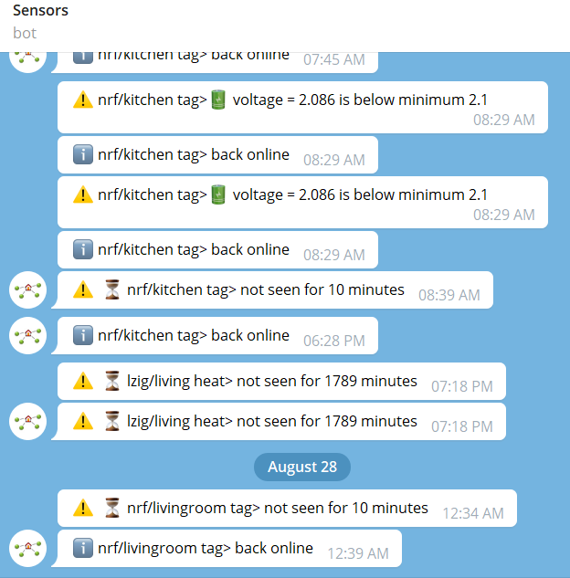

# watchbots
Telegram bots (Telegraf) that watch MQTT topics for:
- liveliness (topic not updated within a threshold)
- low battery (field drops below a threshold)



## How it works
- Subscribes to all topics listed in `config.json` under `mqtt.lists.*`.
- On each message:
  - if payload contains `last_seen` and it is “fresh” (basically *now*), it uses that timestamp,
  - otherwise it uses the local receive time.
- Every ~10 seconds it checks `alive_minutes_sensor` / `alive_minutes_list` and sends Telegram alerts via `sensors_watch_bot`.

## Setup
1) Create `watchbots/secrets.json` (this repo ignores it on purpose):
   - copy `watchbots/secret_template.json` → `watchbots/secrets.json`
   - fill `bots.sensors_watch_bot.token` + `chatId`
   - add your Telegram user id(s) to `users`

2) Edit `watchbots/config.json`:
   - set `mqtt.host`/`mqtt.port`
   - set your topic lists (e.g. `mqtt.lists.eurotronics`)
   - tune `alive_minutes_sensor` thresholds

## Install (systemd, same convention as Loki/Promtail)
From repo root:
```bash
export RASPI_HOME=/home/wass/raspi
source ./env.sh
install watchbots
```

This runs `watchbots/install` (does `npm ci` and creates `/var/log/watchbots`) and then installs/enables `watchbots/watchbots.service`.

Logs:
```bash
journalctl -u watchbots -f
```

## Notes for Eurotronic TRVs (Zigbee2MQTT)
- Add TRV topics to `mqtt.lists.eurotronics` as `lzig/<friendly name>`.
- Set `alive_minutes_sensor.eurotronics` to slightly above the expected reporting cadence.
- If TRVs “take set but don’t report”, run: `eurotronic reconfigure` (see repo root `env.sh`).
